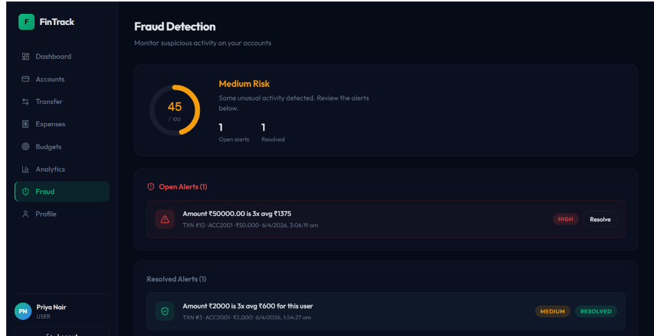

# FinTrack — Secure Personal Finance Platform

A full-stack fintech platform that enables users to manage accounts, track expenses, enforce budgets, detect suspicious transactions, and visualize financial insights through an interactive dashboard.


---

## Features

###  User Features

* Secure JWT Authentication
* Multi-Account Management
* Expense Tracking
* Budget Creation & Monitoring
* Money Transfers Between Accounts
* Personal Analytics Dashboard
* Login History Monitoring

### Security Features

* bcrypt Password Hashing
* JWT-Based Authorization
* Login Lockout Protection
* Fraud Detection Engine
* Immutable Audit Logs
* Budget Enforcement Triggers
* Race Condition Protection using Row-Level Locks

### Admin Features

* User Management
* Fraud Alert Monitoring
* System Analytics
* Administrative Dashboard

---

##  System Architecture


---

## Screenshots

### Dashboard


### Analytics


### Fraud Detection



### Admin Panel


---

## 🛠️ Tech Stack

| Layer          | Technology                |
| -------------- | ------------------------- |
| Frontend       | React, Vite, Tailwind CSS |
| Backend        | Flask, Python             |
| Database       | PostgreSQL 15 (Neon)      |
| Authentication | JWT                       |
| Security       | bcrypt                    |
| Deployment     | Vercel / Render / Railway |

---

## Quick Start

### 1. Clone Repository

```bash
git clone https://github.com/debugLatte/CipherFi-Fintech-Platform.git
cd CipherFi-Fintech-Platform
```

### 2. Database Setup

Run SQL files in order:

```text
01_schema.sql
02_views.sql
03_functions.sql
04_triggers.sql
05_seed_data.sql
```

### 3. Backend

```bash
cd backend

python -m venv venv

# Windows
venv\Scripts\activate

pip install -r requirements.txt

python app.py
```

Backend runs at:

```text
http://localhost:5000
```

### 4. Frontend

```bash
cd frontend

npm install
npm run dev
```

Frontend runs at:

```text
http://localhost:5173
```

---

##  Demo Credentials

| Email                                           | Password    | Role  |
| ----------------------------------------------- | ----------- | ----- |
| [admin@fintrack.com](mailto:admin@fintrack.com) | password123 | Admin |
| [arjun@demo.com](mailto:arjun@demo.com)         | password123 | User  |
| [priya@demo.com](mailto:priya@demo.com)         | password123 | User  |
| [rahul@demo.com](mailto:rahul@demo.com)         | password123 | User  |

---

##  Project Structure

```text
backend/
frontend/
sql/
```

---

##  Database Design

The database follows Third Normal Form (3NF) to eliminate redundancy and maintain data integrity.

### Core Tables

* Users
* Accounts
* Transactions
* Expenses
* Budgets
* FraudAlerts
* AuditLogs
* LoginHistory

---

##  Security Architecture

* JWT Authentication
* bcrypt Password Hashing
* Login Lockout Trigger
* Fraud Detection Functions
* Audit Trail Logging
* Row-Level Database Locking
* Budget Enforcement Triggers

---

##  Developer

Disha Grover

Built as a secure full-stack fintech application showcasing advanced SQL concepts, database design, security engineering, and modern web development.
