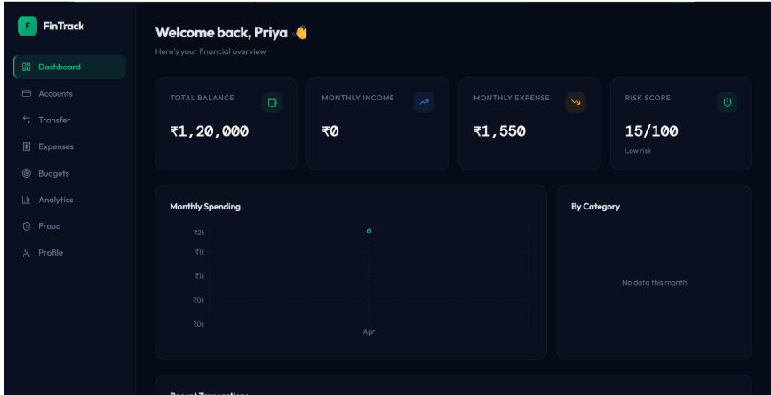
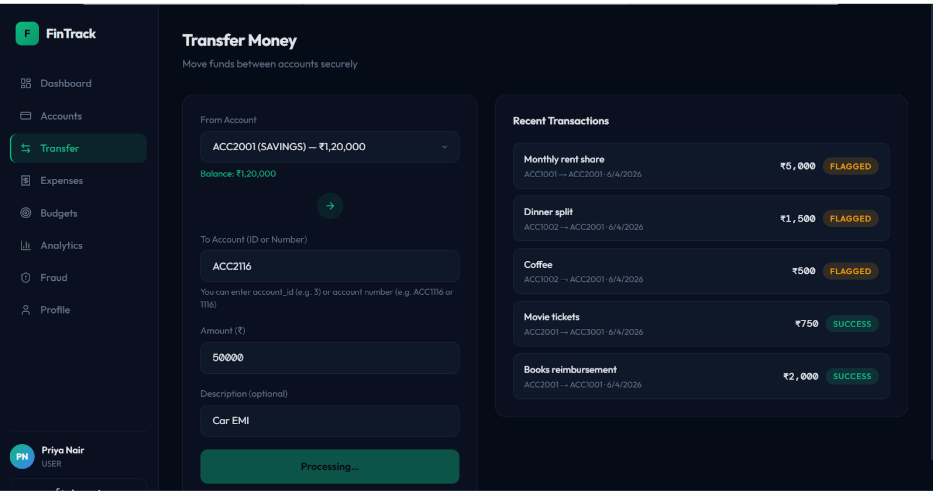
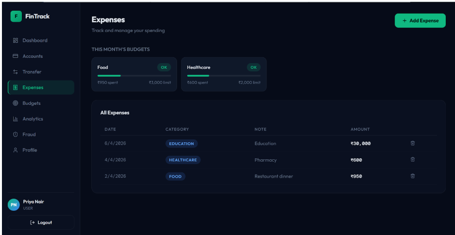
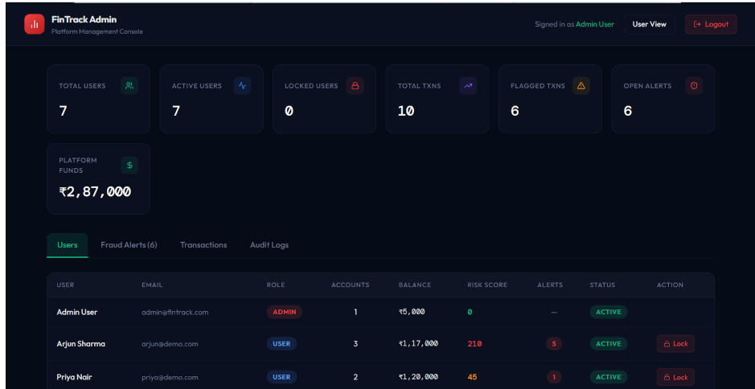
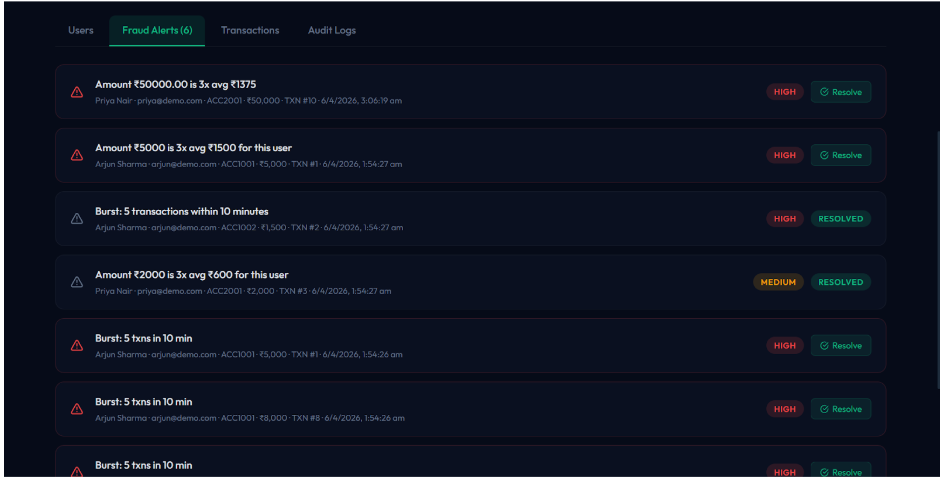

#  FinTrack — Secure Personal Finance Platform

A secure full-stack fintech platform built with **React, Flask, and PostgreSQL** that enables users to manage accounts, track expenses, enforce budgets, detect suspicious transactions, and visualize financial insights through an interactive dashboard.

<p align="center">
  
</p>

---

##  Features

### User Features

* Secure JWT Authentication
* Multi-Account Management
* Expense Tracking
* Budget Creation & Monitoring
* Money Transfers Between Accounts
* Financial Analytics Dashboard
* Login History Monitoring

###  Security Features

* bcrypt Password Hashing
* JWT-Based Authorization
* Login Lockout Protection
* Fraud Detection Engine
* Immutable Audit Logs
* Budget Enforcement Triggers
* Soft Delete Protection
* Row-Level Locking for Safe Transfers

### Admin Features

* User Management
* Fraud Alert Monitoring
* Platform Analytics
* Administrative Dashboard

---

## Application Preview

###  User Dashboard

<p align="center">
  
  
</p>

### Budget Management & Fraud Detection

<p align="center">
  
  
</p>

###  Admin Console

<p align="center">
  
  
</p>

---

##  System Architecture

Frontend → Flask REST API → PostgreSQL (Neon)

* React + Vite frontend
* Flask backend with REST APIs
* PostgreSQL database hosted on Neon
* JWT-based authentication and authorization
* SQL views, functions, and triggers for analytics and security

---

## 🛠️ Tech Stack

| Layer          | Technology                |
| -------------- | ------------------------- |
| Frontend       | React, Vite, Tailwind CSS |
| Backend        | Flask, Python             |
| Database       | PostgreSQL 15 (Neon)      |
| Authentication | JWT                       |
| Security       | bcrypt                    |
| Charts         | Recharts                  |
| Deployment     | Vercel / Render / Railway |

---

##  Quick Start

### 1. Clone Repository

```bash
git clone https://github.com/debugLatte/CipherFi-Fintech-Platform.git
cd CipherFi-Fintech-Platform
```

---

### 2. Database Setup

Create a free Neon database:

1. Visit https://neon.tech
2. Create a new project
3. Open SQL Editor
4. Run SQL files in order:

```text
01_schema.sql
02_views.sql
03_functions.sql
04_triggers.sql
05_seed_data.sql
```

Copy your Neon connection string.

---

### 3. Backend Setup

```bash
cd backend

python -m venv venv

# Windows
venv\Scripts\activate

# Linux/Mac
source venv/bin/activate

pip install -r requirements.txt
```

Create `.env`:

```env
DATABASE_URL=your_neon_connection_string
JWT_SECRET_KEY=your_secret_key
```

Start backend:

```bash
python app.py
```

Backend runs at:

```text
http://localhost:5000
```

---

### 4. Frontend Setup

```bash
cd frontend

npm install
npm run dev
```

Frontend runs at:

```text
http://localhost:5173
```

---

##  Demo Credentials

| Email                                           | Password    | Role  |
| ----------------------------------------------- | ----------- | ----- |
| [admin@fintrack.com](mailto:admin@fintrack.com) | password123 | ADMIN |
| [arjun@demo.com](mailto:arjun@demo.com)         | password123 | USER  |
| [priya@demo.com](mailto:priya@demo.com)         | password123 | USER  |
| [rahul@demo.com](mailto:rahul@demo.com)         | password123 | USER  |

---

##  Project Structure

```text
fintrack/
│
├── assets/
│   ├── admin-analytics.png
│   ├── admin-overview.png
│   ├── budget.png
│   ├── fraud.png
│   ├── user-overview.png
│   └── user-transactions.png
│
├── backend/
│
├── frontend/
│
├── sql/
│   ├── 01_schema.sql
│   ├── 02_views.sql
│   ├── 03_functions.sql
│   ├── 04_triggers.sql
│   └── 05_seed_data.sql
│
└── README.md
```

---

##  Database Design (3NF)

The database follows **Third Normal Form (3NF)** to eliminate redundancy and maintain data integrity.

### Core Tables

| Table        | Description            |
| ------------ | ---------------------- |
| Users        | Platform users         |
| Accounts     | User bank accounts     |
| Transactions | Money transfers        |
| Expenses     | Expense records        |
| Budgets      | Monthly budget limits  |
| FraudAlerts  | Fraud detection alerts |
| AuditLogs    | Immutable audit trail  |
| LoginHistory | Authentication history |

### Key Design Decisions

* No redundant computed attributes
* Foreign-key-driven relationships
* Budget constraints enforced at database level
* Fraud scores generated dynamically
* Fully normalized schema to prevent anomalies

---

##  Security Architecture

### Authentication

* JWT Access Tokens
* Protected Routes
* Role-Based Access Control

### Password Security

* bcrypt Hashing
* Salted Password Storage

### Database Security

* Login Lockout Trigger
* Budget Enforcement Trigger
* Fraud Detection Trigger
* Soft Delete Protection
* Audit Logging

### Transaction Safety

* Row-Level Locking
* Atomic Transfers
* Race Condition Prevention

---

##  Advanced SQL Features

### Views

* User Spending Analytics
* Monthly Expense Summaries
* Budget Performance Metrics
* Fraud Monitoring Views

### Stored Functions

* Transfer Money
* Risk Score Calculation
* Fraud Detection Logic

### Triggers

* Login Lockout
* Budget Enforcement
* Audit Logging
* Fraud Analysis
* Soft Delete Protection

---

## Developer

**Disha Grover**

Built to demonstrate:

* Database Design (3NF)
* Advanced SQL
* Cybersecurity Principles
* Full-Stack Development
* Secure Financial Systems
* REST API Design
